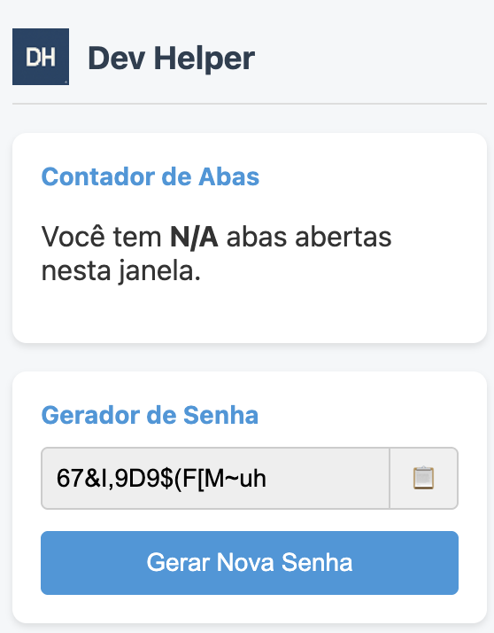

# Dev Helper - Extensão para Chrome

Uma extensão simples e funcional construída com Manifest V3 como parte do projeto do Bootcamp. A "Dev Helper" oferece ferramentas úteis para o dia a dia de desenvolvedores, como um contador de abas, um gerador de senhas seguras e um destacador de links.

## 🌐 Página do Projeto (GitHub Pages)

Confira a landing page da extensão em ação:
**[Acesse a página do Dev Helper aqui](https://Neves111.github.io/Extensao_Chrome/)**

## ✨ Funcionalidades

* **Contador de Abas:** O ícone da extensão exibe dinamicamente o número de abas abertas na janela atual.
* **Gerador de Senha Segura:** Um popup com um clique gera senhas fortes de 16 caracteres, prontas para serem copiadas.
* **Destacador de Links:** Em domínios específicos (configurado para `developer.chrome.com`), a extensão aplica um contorno visual em todos os links `<a>` para facilitar a navegação.

## 🛠️ Instalação

Você pode instalar a extensão de duas maneiras:

### 1. Pela Release (Recomendado)

1.  Vá para a [**página de Releases**](https://github.com/Neves111/Extensao_Chrome/releases).
2.  Baixe o arquivo `.zip` da versão mais recente (ex: `dev-helper-v1.0.0.zip`).
3.  Descompacte o arquivo em um local permanente no seu computador.
4.  Abra o Google Chrome e navegue até `chrome://extensions`.
5.  Habilite o **"Modo do desenvolvedor"** no canto superior direito.
6.  Clique em **"Carregar sem compactação"** e selecione a pasta que você acabou de descompactar.

### 2. Para Desenvolvimento (Carregando o código-fonte)

1.  Clone este repositório: `git clone https://github.com/Neves111/Extensao_Chrome.git`
2.  Navegue até `chrome://extensions`.
3.  Habilite o **"Modo do desenvolvedor"**.
4.  Clique em **"Carregar sem compactação"** e selecione a pasta raiz do repositório clonado.

## 🗂️ Estrutura do Projeto

/
├─ src/                # Código-fonte da extensão
│  ├─ background/      # Service Worker para tarefas em segundo plano
│  ├─ content/         # Scripts injetados em páginas web
│  └─ popup/           # Arquivos da interface do popup (HTML, CSS, JS)
├─ icons/              # Ícones da extensão em vários tamanhos
├─ docs/               # Arquivos para a publicação no GitHub Pages
├─ manifest.json       # Arquivo de manifesto (coração da extensão)
├─ README.md           # Este arquivo
└─ LICENSE             # Licença do projeto (MIT)

## 📝 Licença

Este projeto está licenciado sob a **Licença MIT**. Veja o arquivo [LICENSE](LICENSE) para mais detalhes.
